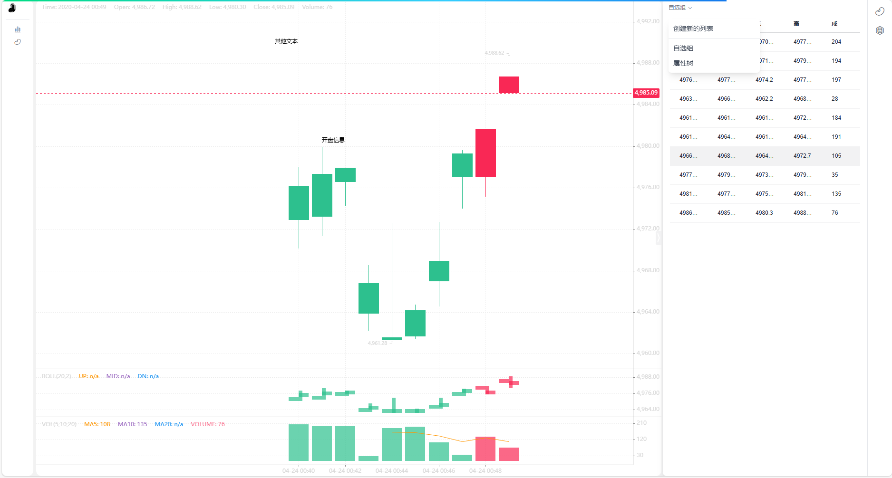

# [AData](https://adata.30006124.xyz)

  

## [介绍](https://adata.30006124.xyz/idea.html)
> 专注A股，专注量化，向阳而生；开放、纯净、持续、为Ai(爱)发电。
>
> 专注股票行情数据，为了保证数据的高可用性，采用多数据源融合切换。
>
> 目标：支持个人量化行情的需要；众人拾柴火焰高，欢迎加入。

**市场寒冷，发热不易，坚持更难；如有帮助到你，右上角点 ⭐Star 一键三连，谢谢支持和收藏^\_^**

## 关于本项目

1. 导出数据的格式标准化:

    - 建议采用常见的 CSV 或 Excel 表格格式导出数据,包括股票代码、交易时间、开盘价、最高价、最低价、收盘价、成交量等基础 K 线数据
    - 标注数据可以用额外的几列表示,包括标注点的时间、标注类型、标注内容等
    - 这样既方便用户进一步分析和计算,也便于系统对数据进行读取和处理

2. Label 的分类设置:
    - 系统可以提供一些常见的标注类型,如趋势线、支撑/阻力位、缺口、反转信号等
    - 同时也可以让用户自定义标注类型,满足个性化需求
    - 两种方式可以结合使用,既有标准化的标注类型,也支持用户自行扩展

## 项目截图

